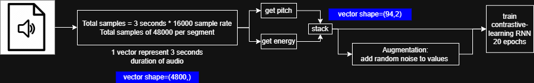
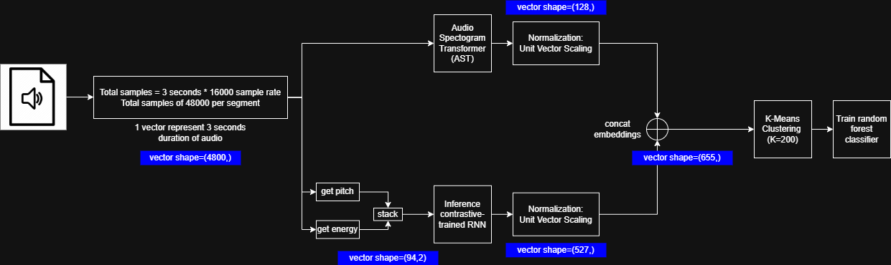

# unlabelled-speaker-recognition

## Overview

This solution primarily focuses on the **design and conceptual architecture** of the model. The Python notebooks included are intended for quick prototyping, compatibility testing, and exploration of vector representations across different models. Conceptual diagrams were created to explain the code flows and algorithms.

> ⚠️ Note: This repository does **not include any code for evaluation testing.**

- Sample data is sourced from [OpenSLR LibriSpeech (dev-clean)](https://www.openslr.org/12).
- Diagram were created using [draw.io](https://draw.io).

The code and notebooks are structured to test feasibility, not as a finalized implementation pipeline.

## Scope

- To investigate potential approaches for detecting and recognizing
  individual speakers from a dataset of over 200 unlabelled microphone
  recordings. When a voice is present, the goal is to identify which of the 200
  speakers it belongs to.

- **Background**: You have been provided with a dataset containing over
  recordings from various microphone speakers. These recordings are completely
  unlabelled; we do not know the identity of the speaker in any given segment.
  Your task is to explore and propose a feasible solution for automatically
  recognizing/labelling which of the 200 speakers is speaking.

## 🔍 Data Exploration and Analysis [10%]

### 🧹 1. Data Cleaning

Typical audio cleaning steps include removing silence, trimming long pauses, and applying noise reduction. It is not included in my processing of sample audio data as it is already refined. Cleaned audio data helps to sample meaningful audio segments.

### ⏱️ 2. Duration Normalization

Assuming data imbalance wasn’t a concern, variation in clip lengths could still lead to uneven segment counts per speaker. Visualizing clip durations and trimming or padding to a target average helps maintain balance and uniformity across the dataset. Padding techniques would be duplicating final segments of a clip until reached the target average length.

### 📊 3. Spectrogram Inspection

Mel spectrograms provided a visual sense of how each speaker sounds — showing variation in speech texture, clarity, and articulation. This helped confirm that different speakers exhibit distinct acoustic patterns worth modeling.

### 🎭 4. Prosodic Feature Observation

By plotting pitch and energy curves, we gained deeper insights into how different speakers express themselves rhythmically and stylistically. This step validated our hypothesis that prosody contains discriminative cues that are complementary to AST features.

## 🧩 Proposed Solution(s) and Justification [50%]

The core idea of this solution is to reframe the problem of unsupervised speaker (or speech style) grouping into a **representation learning task** that captures both:

- **Phonetic and acoustic features** using a pretrained **AST (Audio Spectrogram Transformer)** model
- **Prosodic features** using a lightweight custom **RNN** trained on pitch and energy dynamics

### 🔁 Pipelines:

1. **Segmentation**  
   All raw audio files are split into fixed-length waveform segments (e.g., 3 seconds each) to ensure uniform input size across models.

2. **Feature Extraction**

   - **AST**: Each segment is passed through a pretrained AST model (fine-tuned on AudioSet) to obtain high-level embeddings that capture **phonetic content** and **acoustic patterns**.
   - **prosody-rnn**: In parallel, pitch and energy features are extracted from each segment using `librosa`. These frame-level prosodic features are passed through a small RNN trained using **contrastive learning**. The RNN learns to generate **style-aware embeddings** by grouping **augmented views** (e.g., noise, masking) of the same segment closer together, while pushing different segments apart.

3. **Embedding Concatenation**

   - The outputs from AST and prosody-rnn are normalized and concatenated into a single vector per segment. This joint embedding captures both the **acoustic delivery** (from AST) and the **prosodic patterns** (from ProsodyRNN), representing _how_ something is spoken — including style, rhythm, and vocal expression during speech.

4. **Clustering & Classification**
   - Unsupervised clustering (KMeans) is applied on the combined embeddings to discover natural groupings.
   - A RandomForest classifier is optionally trained using the cluster labels as pseudo-labels to enable faster inference.

### ✅ Justification

- **AST** already provides strong pretrained representations of speech acoustics and phonemes.
- **Prosody features** are complementary, capturing expressive elements such as emotion, speaker style, and speaking rate that AST may overlook.
- By combining both views, the system aims to better reflect **speaker identity or style**.
- After unsupervised clustering (of 200 clusters), a **Random Forest classifier** is trained on the cluster assignments as pseudo-labels. This offers a **scalable and efficient solution** during inference, as applying a trained classifier is significantly faster and simpler than re-running high-clusters clustering classification.

The approach is **fully unsupervised**, **modular**, and supports various evaluation strategies.

## Implementation Strategy (Conceptual) [20%]:

### Conceptual Diagrams

#### Contrastive Learning for Prosody Model

#### Classifier Model Training

#### Inference Pipeline

### 🔍 Evaluation

Since this is a fully unsupervised approach, the evaluation focuses on **qualitative assessments** and **manual verification techniques** to judge the quality of the discovered groupings.

#### 🎧 1. Manual Listening Evaluation

A small number of segments from each predicted group (or cluster) are sampled and listened to manually. This allows for:

- Verifying whether segments in the same cluster sound like they come from the same speaker or share similar speaking style.
- Checking consistency in vocal tone, rhythm, and prosodic delivery.

> human-in-the-loop evaluation is essential when labels are unavailable.

#### 📈 2. Spectrogram and Prosody Visualization

For a selected subset of segments:

- **Mel spectrograms** are plotted and visually compared within clusters.
- **Prosodic curves** (pitch and energy) are overlaid per segment to detect stylistic similarity.

These visual tools help in assessing whether the grouped segments exhibit shared **acoustic and prosodic characteristics**, such as intonation patterns, energy levels, and pacing.

#### 🌀 3. Embedding Space Projection (t-SNE)

To visually inspect the embedding quality, we applied **t-SNE** to reduce the joint (AST + prosody-rnn) vectors to 2D. This allows us to:

- Observe whether the model forms **distinct clusters** of speaking styles or vocal identities.
- Validate that segments within the same cluster are **tightly grouped**, while others are well-separated.

#### 🗃️ Additional method: Pseudo-Quantitative Checks

A small portion of the data can be **manually annotated** (e.g., gender, identity), and cluster alignment can be checked against these annotations for an informal measure of clustering relevance.

## ⚠️ Challenges and Considerations [20%]

### 🎯 1. No Ground Truth for Evaluation

- Without labeled data, it's difficult to **objectively measure performance**.
- Evaluation depends heavily on **qualitative checks** like manual listening and visual inspection.
- Clusters might reflect **style or emotion** rather than actual speaker identity.

🔧 _Potential mitigation:_

- Manually annotate a **small subset** of data for sanity checks.

### 🧍 2. Overlapping Speaker Characteristics

- Many speakers may share **similar accents, pitch ranges, or speaking styles**.
- This overlap can confuse the model, leading to **merged clusters**.

🔧 _Potential mitigation:_

- Use **longer segments** per speaker to capture richer voice patterns.

### 🔉 3. Variation in Audio Recording Quality

- Background noise, reverberation, and recording artifacts can mask speaker cues.
- AST is trained to be robust, but **prosody features (pitch/energy)** are still sensitive.

🔧 _Potential mitigation:_

- Apply **audio denoising** steps before feature extraction.
- Use **noise augmentation** during training to increase robustness.

### 🗂️ 4. Scalability to Large Datasets

- Processing millions of segments is computationally expensive, especially for AST inference.
- Clustering hundreds of thousands of vectors can also be memory-intensive.

🔧 _Potential mitigation:_

- Use data sampling strategies to reduce the number of segments, making the pipeline more scalable without heavily compromising diversity.

### 🧠 5. Limitations of Contrastive Learning for Prosody

- The effectiveness of contrastive learning heavily depends on the quality and diversity of augmentations.
- If augmentations are too weak (e.g. small noise, minimal masking), the model might fail to learn meaningful distinctions.
- Without hard positives/negatives, the model may collapse or become overly generalized.

🔧 Potential mitigation:

- Design stronger and more diverse augmentations that reflect realistic prosodic variation.
- Explore temporal warping, pitch shifting, segment swapping, or even synthetic prosody blending.
- Monitor contrastive loss trends and validate with manual samples to ensure the RNN is learning meaningful speaker traits.

### 📌 6. Ambiguity in Cluster Meaning

- Clusters may not represent speakers exclusively; they could reflect:
  - Emotions
  - Speaking rate
  - Acoustic environments

🔧 _Assumption needed:_

- We assume that **style + voice characteristics correlate** with speaker identity in absence of other labels.
